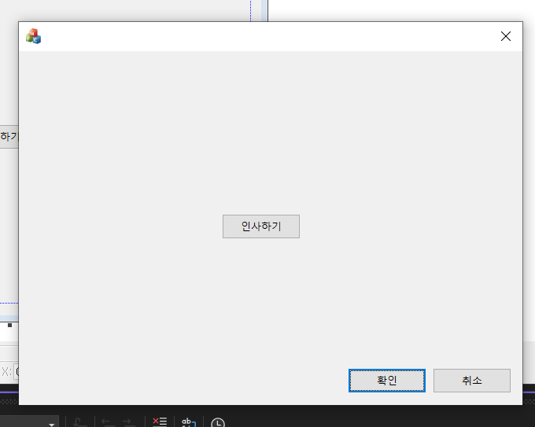
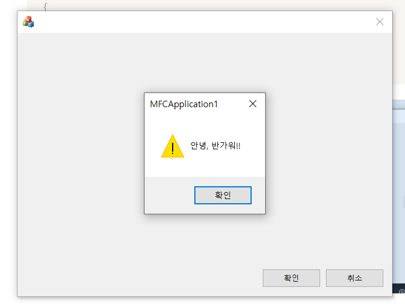
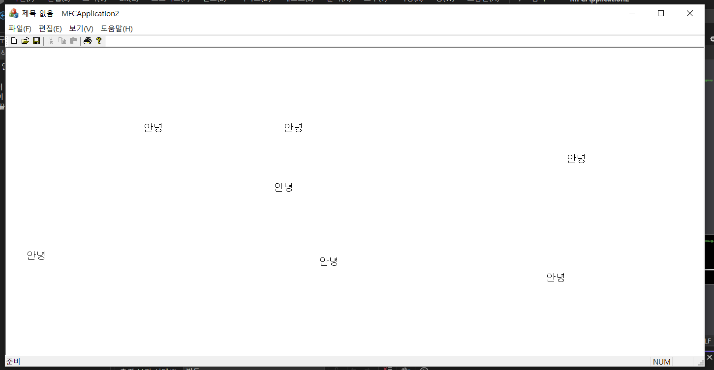

### 대화상자 기반 APP

- 프로그램이 실행됨과 동시에 바로 대화상자를 표시하는 Application의 한 형태
- 비교적 간단한 사용자 인터페이스용 Application을 만들 때 주로 사용

### 도구 상자

- Visual Studio에서 Windows용 컨트롤들을 모아서 보여주는 창

```cpp
void CMFCApplication1Dlg::OnBnClickedButton1()
{
	// On~: 핸들러함수
	AfxMessageBox(_T("안녕, 반가워!!"));
}
```
| 이미지1 | 이미지2 |
|:-------:|:-------:|
|  |  |

<aside>

**💡객체지향이란 무엇인가요?**

: 프로그램 설계 방법론의 하나

: 프로그램을 수많은 객체라는 단위로 나누고, 이 객체들 사이의 상호작용을 기술하는 방식으로 설계하는 방법론

- 캡슐화
- 상속
- 다형성
</aside>

### 단일문서(SDI) APP

- SDI: Single Document Interface (한 순간에 하나의 문서만을 처리하는 Application의 한 형태)
- 하나의 문서가 표시되는 상태에서 다른 문서를 개방하면, 이전 문서가 닫히는 구조

### MFC Framework

- MFC Application을 쉽고 편리하게 만들 수 있도록 자동으로 생성해 주는 기본 골격
- 개발자는 이 기본 골격에 자신이 원하는 부분만을 추가하여 개발하면 됨

### 클래스 뷰 Class View

- Visual Studio에서 현재 프로젝트의 클래스들을 모아서 보여주는 창
- 각 클래스 별로, 멤버변수와 멤버함수 표시

***MDI (Multi Document Interface)**

여러 개 한 번에 열 수 있도록 하는 인터페이스 (ex. PPT, Visual Studio 등)

**MFC Framework 구성 요소**

- MainFrame → 액자 (캡션 관련)
- View → 하얀색 화면 내부
- Doc → 문서 저장 및 조회
- App → 전체적인 관리

### 단일 문서 App 생성 실습

```cpp
void CMFCApplication2View::OnLButtonDown(UINT nFlags, CPoint point)
{
	// view에서 왼쪽 버튼 누른다면..
	CDC* pDC = GetDC(); //DC: 출력 장치에 그리기를 할 때 필요한 그리기 정보 묶음 (Device Context)
	pDC->TextOut(point.x, point.y, _T("안녕"));
	ReleaseDC(pDC);

	CView::OnLButtonDown(nFlags, point);
}
```



<aside>

**💡MFC Framework는 MVC 패턴을 따르는가?**

MVC: 디자인 패턴 중 하나

- Model(자료처리)
- View(화면처리)
- Control(제어처리)

**MFC Framework의 구조**

- App
- MainFrame
- View
- Document

App = Control, MainFrame & View = View, Document = Model 담당

</aside>