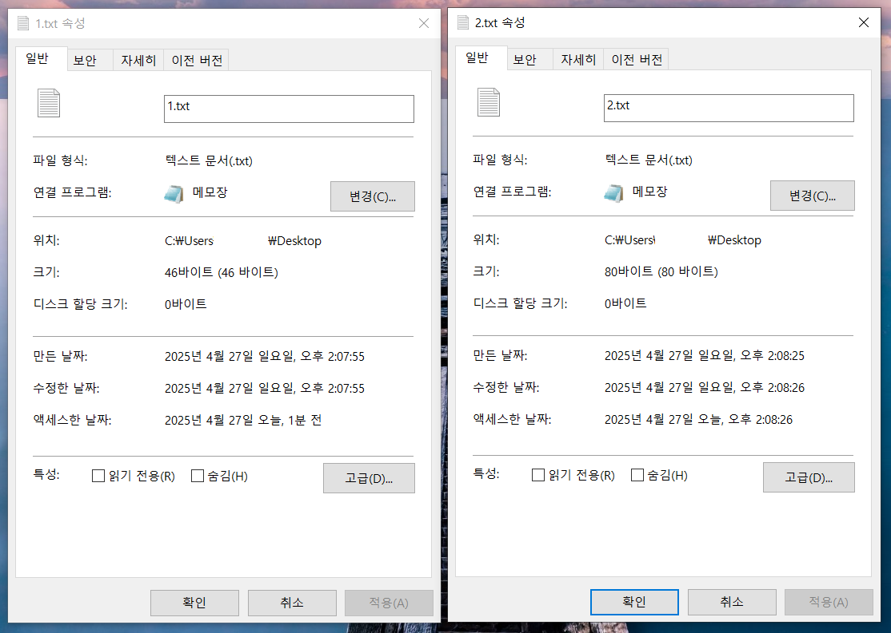

### 변환

- 의미나 내용을 바꾸지 않고, 지정된 규칙에 따라서 정보의 모양이나 형식을 바꾸는 것

### 인코딩

- 정보의 형태를 다른 형태로 변환하는 처리
- 암호화라고도 부름
- 목적은 정보의 표준화, 보안, 처리속도 향상, 저장 공간의 절약 등을 위함

### 디코딩

- 인코딩된 정보를 이전 상태로 되돌리는 처리
- 복호화라고도 부름

### 다양한 문자코드 파일

MBCS (ANSI) → WBCS (유니코드)

- 메모장으로 문자를 다양한 문자코드 파일 만들기
- 각 파일의 사이즈 비교하기
- 각 파일의 메모리 내용 확인하기



- 1.txt: ANSI (한글만 2Byte, 영어는 1Byte)
- 2.txt: UTF-16 (전부 다 2Byte)

UTF는 유니코드에 포함! 

BOM(Byte Order Mark) → 데이터들이 저장되는 방식 마킹

```c
//ANSI코드
char str[] = "ABC한글";
int len = strlen(str);
printf("문자열 길이: %d \n", len);

//유니코드
wchar_t str[] = "ABC한글";
int len = wstrlen(str);
wprintf(L"문자열 길이: %d \n", len);
```

⇒ 범용 Type으로 프로그래밍할 수 있는 방법?

### 유니코드의 지원

**문자형**

```c
#ifdef UNICODE
    typedef WCHAR TCHAR;
#else
	typedef char TCHAR;
#endif
```

**문자열 상수**

```c
#ifdef _UNICODE
	#define __TEXT(quote) L##quote
// __TEXT(quote) == _T(quote)
#else
	#define __TEXT(quote) quote
#endif
```

**메시지:** 시스템이 받는 쪽의 문자 코드에 맞게 변환해줌

**리소스:** 유니코드 사용여부와 상관없이, 항상 유니코드 포맷으로만 작성